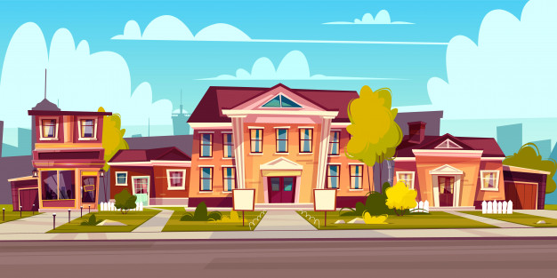
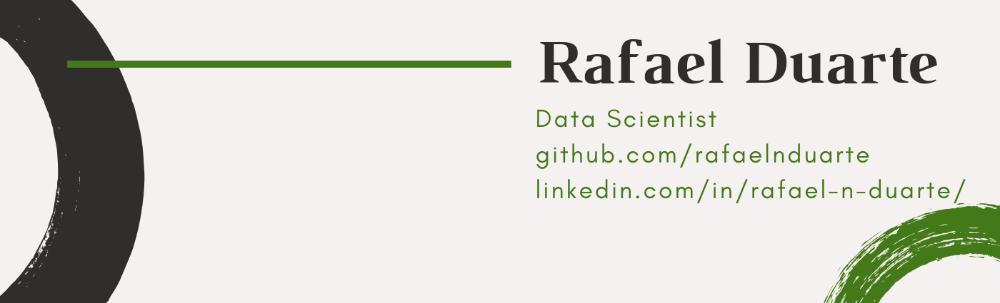

   

# Kaggle_House_Prices

Ask a home buyer to describe their dream house, and they probably won't begin with the height of the basement ceiling or the proximity to an east-west railroad. But this playground competition's dataset proves that much more influences price negotiations than the number of bedrooms or a white-picket fence.

  

With 79 explanatory variables describing (almost) every aspect of residential homes in Ames, Iowa, this competition challenges data scientists to predict the final price of each home.

**The goal of the project is to predict the sales price for each house. For each Id in the test set, we must predict the value of the SalePrice variable.**

**Submissions are evaluated on Root-Mean-Squared-Error (RMSE) between the logarithm of the predicted value and the logarithm of the observed sales price. (Taking logs means that errors in predicting expensive houses and cheap houses will affect the result equally.)**

  

